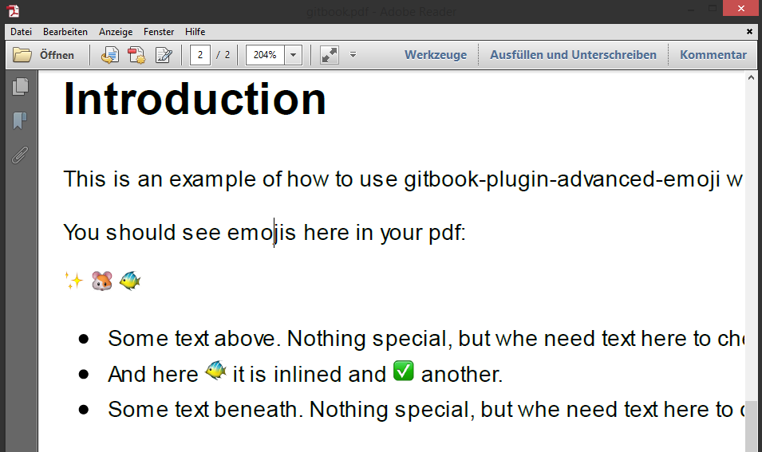

# Introduction

This is an example of how to use gitbook-plugin-advanced-emoji with *pdf export*


You should see emojis here in your pdf:

:sparkles: :hamster: :tropical_fish:


  * Some text above. Nothing special, but whe need text here to check margin of emojis.
  * And here :tropical_fish: it is inlined and :white_check_mark: another.
  * Some text beneath. Nothing special, but whe need text here to check margin of emojis.


## Howto build PDF of this GitBook

```
npm run gitbook:install
npm run gitbook:pdf
```

Now you should see a `gitbook.pdf` file.


## How it will look

It should look like this:

